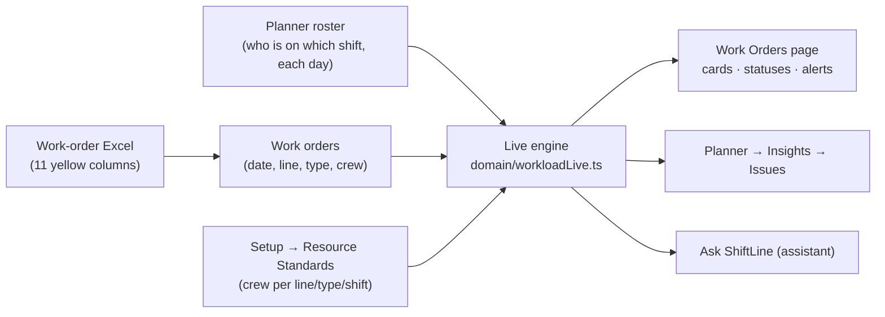

# Work Orders ↔ Planner — how it works

How ShiftLine turns the work-order Excel sheet and the Planner roster into staffing results, and which edit changes which number. Everything below recalculates **live**: there is no "allocate" button.

---

## 1. The chain



For every work order:

| Step | Rule |
|---|---|
| **Day** | Its **Scheduled Start** date (never another month's roster). |
| **Shift** | Its own planned shift; otherwise CM → Evening, PM needing 4+ → Night, everything else → Morning. |
| **Team** | **Line 5** = Line 5 people. **Line 4 & Line 6 = one shared team** (people of both lines together). |
| **Available** | People of that team whose Planner cell that day belongs to the shift's family. `M`, `ML`, `MT` count as Morning (same for Evening and Night). GS, Project, Leave and rest do **not** count. |
| **Crew needed** | The Setup standard for line + type + shift, unless the row has its own number (set with −/+). |
| **Assignment** | Free people on that shift are handed out; nobody is booked twice on the same day and shift. A hand-picked crew (Manage Crew) is kept while those people are still on the shift. |
| **Buffer** | Available − Demand (sum of crew needed by that day's orders on that shift). Below 0 = **staff deficit**. |

### Statuses

| Status | Meaning |
|---|---|
| Staffed | Enough people assigned. |
| Shortfall | Some assigned, fewer than needed. |
| Nobody free / Unassigned | Nobody on that shift that day (or all already used). |
| No roster | The line's team has no people yet (add them in **People**). |
| Not placed | No valid Scheduled Start or Line in the file, so it can't be put on a day. Kept out of demand. |

---

## 2. Which edit changes which result

| You change… | Where | What updates |
|---|---|---|
| A cell onto / off a shift | Planner | That day's shift card, the orders' status and crew names, deficit count, red day buttons, Insights issues |
| Leave | Planner / People | Same as above |
| Generate month / Auto-rotate | Planner | Every order in that month |
| Default shift, rest days, rotation | People | Every month not hand-edited |
| A code's family (tone) | Setup → Shift codes | Who counts as Morning / Evening / Night |
| A Resource Standard | Setup | Crew needed by every order tagged "Setup standard" |
| Required People −/+ | Work Orders | That order (its own number from then on; "↺ Use standard" undoes) |
| Shift or crew in Manage Crew | Work Orders | That order and the others sharing its day and shift |
| Import a new Excel file | Work Orders | Everything: all work orders are replaced |

**Example:** a Morning card shows *Available 2 · Demand 3 · −1 Staff Deficit*. Put one more person on Morning that day in the Planner, and the card becomes *3 · 3 · +0* and the alert disappears.

---

## 3. Excel import (only the yellow columns)

Columns are matched by **header name** (case, spaces and punctuation ignored), so column order and title rows above the header don't matter. Every other column (Status, Asset, SR Affected, Actual Start…) is ignored.

| # | Excel header | Used for |
|---|---|---|
| 1 | Work Order | ID |
| 2 | Description | Text; also decides PM / CM / ACS |
| 3 | Location | Asset / location code |
| 4 | Reported Date | Reference: age |
| 5 | Start No Earlier Than | Start of the allowed window |
| 6 | Target Start | Reference: target vs scheduled |
| 7 | Scheduled Start | **The day used on the Planner and in shift demand** |
| 8 | Finish No Later Than | End of the allowed window |
| 9 | Div / Depart | Department |
| 10 | Line | L4 / L5 / L6 |
| 11 | Asset Group | DCS, SIG, ISM, CCT, PAS … |

- **Problems are always reported**, in the **Import report** on the Work Orders page and in Planner → Insights:
  - `Column "Target Start" not found in the file` (whole file)
  - `Row 45: Scheduled Start missing`
  - `Row 12: Line "Depot" is not L4, L5 or L6`
  - `Row 6: Scheduled Start "next week" is not a date`
  - duplicate work order numbers
- **Window checks:**
  - *Outside window*: Scheduled Start before Start No Earlier Than, or after Finish No Later Than.
  - *Past FNLT*: Finish No Later Than is before today.
- **Work type** (not a yellow column), from the Description:
  - CM: fault / failure / breakdown / repair / corrective / defect
  - ACS: ACS / audit / access control
  - otherwise PM
- **Crew size** (not a yellow column): from Setup → Work Order Resource Standards.

### Adding a column later

Add one entry to `src/domain/workOrderColumns.ts`. No importer code changes:

```ts
{ excelHeader: 'Priority', appField: 'priority', required: true, type: 'text', usedFor: 'Job priority' },
```

- `required: true` adds the "missing" checks.
- Unknown `appField`s are stored in `workOrder.extra`.
- The in-app *Yellow Headings Guide* lists it automatically.

---

## 4. Where to fix a deficit

1. **Work Orders** → click a red date to see the day's three shift cards, or open **View All Conflicts** → **Fix in Planner →**.
2. **Planner** → **Insights → Issues** shows a red *Work Orders* entry such as "Day 16 · Morning: need 3, only 2 — short 1". Click **Show who can cover → Assign**.
3. Or lower the order's **Required People**, or move its shift in **Manage Crew**.

---

## 5. Code map

| File | Role |
|---|---|
| `src/domain/workOrderColumns.ts` | Which Excel columns are read (config) + work-type rules |
| `src/domain/workload.ts` | Excel importer, date/line parsing, crew standards lookup |
| `src/domain/workloadLive.ts` | Live engine: placement, staff pools, assignment, balances, window checks |
| `src/app/store.tsx` | Feeds every line's roster to the engine; adds work-order issues to the Planner |
| `src/features/workorders/WorkOrdersPage.tsx` | Work Orders screen |
| `src/features/assistant/appKnowledge.ts` | What the assistant is told about work orders + offline quick help |
| Tests | `src/domain/__tests__/workloadLive.test.ts`, `workloadPlannerSync.test.ts`, `workOrderImport.test.ts` |
