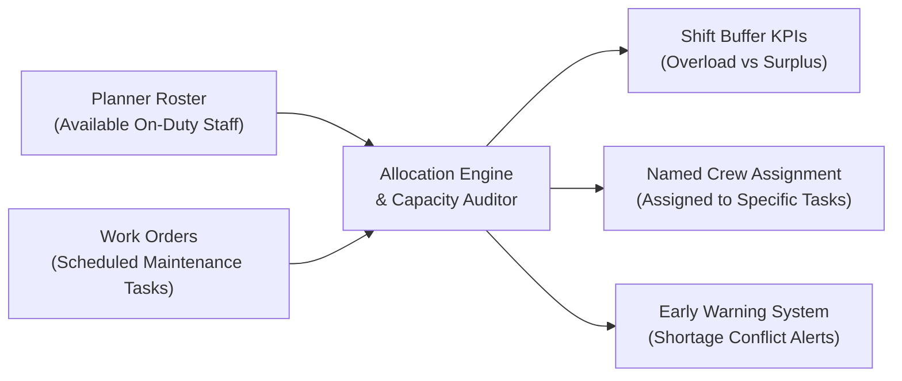
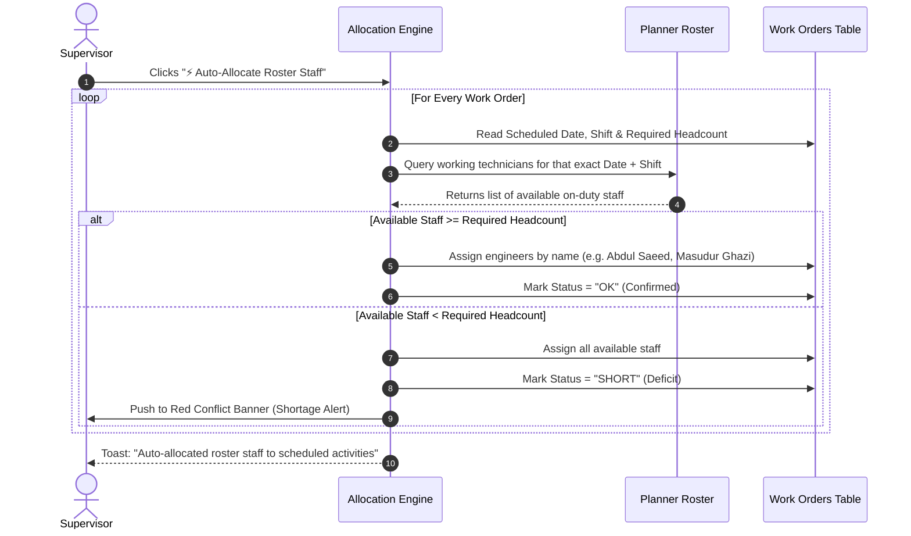
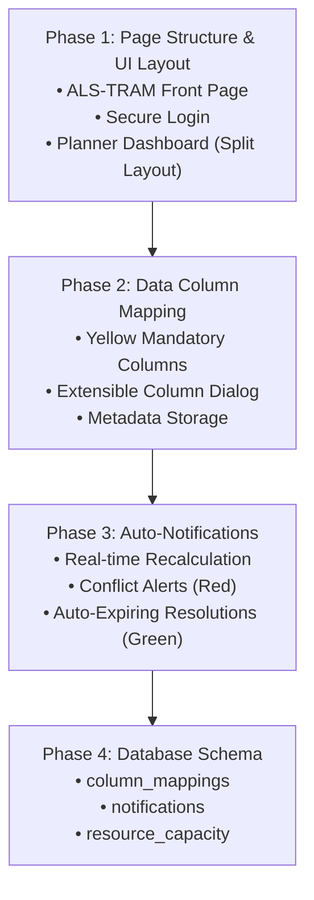
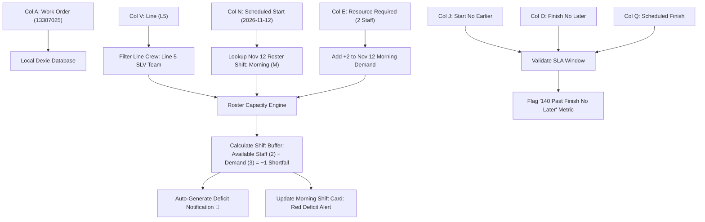

# Work Orders & ShiftLine Roster Integration Guide

An operational and technical reference detailing how the **Work Orders & Manpower Allocation** module functions, how every UI component operates, how the background algorithms calculate capacity, and how it syncs in real-time with the **Planner** and **Setup** configurations.

---

## 1. Executive Overview

In plant and rail transit operations, managing shifts and maintaining equipment typically run as two separate systems:

1. **The Roster (Staff Supply / Planner)**: Determines which technicians are on duty, which shift they work (Morning `M`, Evening `E`, Night `N`), and when they take their mandatory Rest Days (`RD`).
2. **Work Orders (Labor Demand / Maintenance Tasks)**: Extracted from enterprise maintenance schedules (e.g. `Nov-Workorders.xlsx`), containing hundreds of activities across **Line 4, Line 5, and Line 6**, categorised into **PM** (Preventive), **CM** (Corrective), and **ACS** (Access/Audit).

The **Work Orders Module** acts as the real-time bridge between these two worlds:



---

## 2. Core Operational Equation: Net Resource Buffer

Every shift on every production line operates on the fundamental balance equation:

$$\text{Net Resource Buffer} = \text{Available Working Staff} - \text{Total Activity Demand}$$

$$\text{Workforce Load Capacity (\%)} = \left( \frac{\text{Total Activity Demand}}{\text{Available Working Staff}} \right) \times 100$$

### Buffer Status Classifications:
* **Positive Buffer ($+1$ or higher) — Healthy 🟢**:  
  More engineers are on duty than required by scheduled tasks. The excess personnel form a safety net to handle unexpected track breakdowns, emergency corrective repairs, or administrative duties.
* **Zero Buffer ($0$) — At Capacity 🟡**:  
  Every single on-duty engineer is fully assigned to scheduled maintenance. Any unexpected breakdown will cause delays unless overtime or borrowed staff are used.
* **Negative Buffer ($-1$ or lower) — Deficit Alert 🚨**:  
  Scheduled tasks demand more technicians than the roster has on duty. The shift is overloaded ($>100\%$), leading to unexecuted maintenance work orders or severe delays.

---

## 3. Component-by-Component Breakdown

### Component 1: Top Command Header
Located at the top of the Work Orders page, this header gives the supervisor complete macro control.

* **Activity Counter Badge**:  
  Shows the total count of loaded activities (e.g., `314 Activities Loaded`).
* **System Health Badge**:  
  * `100% Balanced 🟢`: All work orders have sufficient crew.
  * `X Deficits Detected 🚨`: Flashes when staff shortages are found.
* **`Upload Excel` Button**:  
  Accepts files like `Nov-Workorders.xlsx`. The parser automatically extracts:
  * Production Line (`Line 4`, `Line 5`, `Line 6`).
  * Scheduled Start Date (`Earlier Due Start` / `Scheduled Start`).
  * Scheduled Finish Date (`Finish Note Later Date` / `Target Finish`).
  * Work Type (`PM`, `CM`, `ACS`).
  * Required Crew Count (`Resource Required`).
* **`⚡ Auto-Allocate Roster Staff` Button**:  
  Runs the matching engine that cross-references the roster to assign working technicians by name.
* **`Export CSV` Button**:  
  Generates a full audit spreadsheet showing every work order, scheduled date, required crew, and the names of all assigned technicians.

---

### Component 2: Shift Capacity & Net Resource Buffer Cards
Three high-visibility cards (Morning, Evening, Night) that summarize shift health:

```
┌────────────────────────────────────────────────────────────────────────────────────┐
│ 🌅 Morning Shift (06:00 – 14:00)                              [-1 Staff Deficit] 🚨 │
├────────────────────────────────────────────────────────────────────────────────────┤
│ AVAILABLE STAFF: 2 engineers              ACTIVITY DEMAND: 3 assigned              │
│ Workforce Load Capacity: [██████████████████████████████] 150%                     │
│ • PM Demand: 2                            • CM Standby: 1                          │
└────────────────────────────────────────────────────────────────────────────────────┘
```

#### What each field represents:
1. **Available Staff**:  
   Total technicians rostered to work that shift on the selected line (engineers on Rest Days `RD` or Leave `L` are excluded).
2. **Activity Demand**:  
   Total technicians consumed by active work orders on that shift (PM scheduled tasks + CM standby quota).
3. **Buffer Badge**:  
   * Green `+2 Buffer Available`: 2 spare technicians available.
   * Red `-1 Staff Deficit`: Short by 1 technician.
4. **Workforce Load Capacity Bar**:  
   Visual utilization gauge (Red if $>100\%$, Cyan/Purple if $\le 100\%$).
5. **Breakdown (PM Demand vs CM Standby)**:  
   * **PM Demand**: Manpower needed for scheduled preventive maintenance.
   * **CM Standby**: Manpower reserved for emergency corrective fixes based on your standards.

---

### Component 3: The Red Warning Banner (`Manpower Resource Shortfalls`)
Acts as the supervisor's **Early Warning System**:

```
┌─────────────────────────────────────────────────────────────────────────────────────────┐
│ ⚠️  Manpower Resource Shortfalls Detected (99 Alerts)                                   │
│     Certain work orders require more staff than currently available on the active shift.│
│                                                [ View All Conflicts ] [ Auto-Balance ]  │
└─────────────────────────────────────────────────────────────────────────────────────────┘
```

#### What triggers this banner?
It scans all 30 days of the month. If on **any specific day** (e.g., Friday the 13th), an activity requires 4 technicians on Night shift, but only 2 technicians are rostered to work that night, an alert is recorded:
> *"Line 5 Night Shift on 2026-11-13 short by 2 engineers (Required: 4, Available: 2)"*

#### Actions:
* **`View All Conflicts`**: Opens an interactive modal listing every problematic work order, exact date, shift, shortage count, and reason.
* **`Auto-Balance Staff`**: Re-evaluates assignments or shifts tasks to neighbouring dates/shifts where technicians have available buffer.

---

### Component 4: The `⚡ Auto-Allocate Roster Staff` Engine
The core algorithm that eliminates hours of manual scheduling:



#### Double-Booking Prevention:
The engine maintains an internal tracking map `busyEmployees(empId, date, shift)`. Once *Abdul Saeed* is assigned to Work Order #101 on Nov 5 Morning, he cannot be assigned to Work Order #102 on that same morning.

---

### Component 5: Operational Line Grouping Tabs & Executive Metrics
In actual railway and plant operations, assets are grouped into two primary operational branches:
* **`Line 4 & 6 (30 short days)`**: Combines DCS (Line 4) and Heavy Maintenance (Line 6) into a single operational unit.
* **`Line 5 (30 short days)`**: Represents the primary SLV mainline corridor.
* **`All Lines`**: High-level macro view of all 313/314 facility work orders.

Directly above these tabs sits the **Executive Schedule Summary Strip**:
```
313 activities due in November | 313 planned | 140 already past Finish No Later Than | 140 planned outside their window | Crew library: 1115 tasks
```
This instantly alerts supervisors to how many tasks are planned vs how many are currently falling outside their maintenance window.

---

### Component 6: Search & Filtering Bar
* **Activity Type Filter**: Switch between `All Types`, `PM (Preventive)`, `CM (Corrective)`, and `ACS (Access/Audit)`.
* **Shift Filter**: Filter by `Morning (M)`, `Evening (E)`, or `Night (N)`.
* **Status Filter**: Filter by `Fully Allocated (OK)`, `Short of Staff (SHORT)`, or `Unassigned`.
* **Live Search**: Instant text search across Work Order ID, Description, or Department.

---

### Component 7: Work Orders Master Data Table
The main enterprise grid listing each job:

| Line | WO ID | Activity Description | Type | Schedule Dates | Required Crew | Assigned Engineers | Status |
| :---: | :---: | :--- | :---: | :---: | :---: | :--- | :---: |
| **L5** | `13445509` | Quarterly track calibration & sensor check | <span style="color:#60a5fa">PM</span> | Nov 01 – Nov 15 | **2 staff** | `[AS] Abdul Saeed`, `[MG] Masudur Ghazi` | <span style="color:#34d399">OK</span> |
| **L5** | `13445582` | Emergency switch repair & motor lubrication | <span style="color:#f59e0b">CM</span> | Nov 04 – Nov 08 | **3 staff** | `[WT] Waqas Tahir` *(Need 2 more)* | <span style="color:#f87171">SHORT</span> |

* **Avatar Chips**: Hovering over technician initials reveals their full name, contact number, and shift role.
* **Interactive Row Click**: Clicking any row opens the **Crew Assignment Modal** to swap or add technicians manually.

---

## 4. Why Shift Buffer Changes Day by Day

The buffer is not a static number—it changes **every 24 hours** based on roster dynamics:

### The 3 Causes of Daily Changes:

1. **Rest Day Rotations (`RD`)**:
   Technicians rotate rest days throughout the week.
   * *Example*: On Monday, 5 engineers are on duty on Morning Shift. On Friday, 3 engineers have their scheduled rest day (`Fr + Sa`), leaving only **2 engineers on duty**.
2. **Work Order Volume Fluctuation**:
   * *Example*: On Tuesday, only 1 minor sensor inspection is scheduled (needs 1 person). On Thursday, 3 major overhauls are scheduled simultaneously (needs 5 people).
3. **Approved Leaves (`L`)**:
   When an engineer is marked on Leave in the Planner, available staff drops by 1 immediately for that period.

### Practical Scenario: Line 5 Morning Shift Across the Week

```
┌──────────────────┬─────────────────┬─────────────────┬──────────────────┬──────────────────┐
│ Day              │ Available Staff │ Scheduled Demand│ Net Buffer       │ Shift Status     │
├──────────────────┼─────────────────┼─────────────────┼──────────────────┼──────────────────┤
│ Monday (Nov 03)  │ 5 Engineers     │ 2 PM + 1 CM = 3 │ +2 Buffer        │ Healthy 🟢       │
│ Tuesday (Nov 04) │ 4 Engineers     │ 2 PM + 2 CM = 4 │ 0 Buffer         │ At Capacity 🟡   │
│ Friday (Nov 07)  │ 2 Engineers*    │ 2 PM + 1 CM = 3 │ -1 Staff Deficit │ Shortage Alert 🚨│
└──────────────────┴─────────────────┴─────────────────┴──────────────────┴──────────────────┘
* Note: On Friday, 3 engineers are on Rest Days (Fr + Sa), causing the deficit.
```

---

## 5. Live Interconnection with Planner and Setup

| When You Make This Change... | What Automatically Happens in Work Orders... |
| :--- | :--- |
| **Change a cell in Planner from `M` to `RD` (Rest Day)** | That engineer is removed from that day's available pool. Any work order assigned to them recalculates immediately; if no replacement is available, it flags a **SHORT** alert. |
| **Change an employee from `Morning` to `Night` in Planner** | Morning shift available headcount drops by 1; Night shift headcount increases by 1. Both shift buffer cards update instantly. |
| **Adjust Resource Standards in Setup** (e.g., change Line 5 Morning PM from 2 to 3 staff) | Every newly created or auto-allocated Line 5 PM work order automatically demands 3 technicians instead of 2. |
| **Switch active Line (Line 4 ↔ Line 5 ↔ Line 6)** | Both the Planner grid and the Work Orders table switch context synchronously to show that line's assets. |

---

## 6. Recent System Updates & Enhancements (What Changed)

To ensure operational security, visual clarity, and flawless alignment between supervisor and collaborator experiences, several major enhancements have been implemented:

### 1. Collaborator Security & Boundary Hardening
* **Live Presence**: Collaborators now see a clean personal `● Online` badge. They cannot inspect other active teammates, browse teammate avatars, or open the collaborator drawer.
* **Notification Bell & Sharing**: Restricted exclusively to supervisors. Collaborators cannot broadcast links or view administrative notifications.
* **Passcode Administration**: Security settings and passcode generation in `Setup` are hidden from collaborator accounts.

### 2. Setup Page Resource Standards Redesign
* Replaced the cluttered 7-card layout with **3 structured Shift Cards** (Morning, Evening, Night) plus a dedicated **ACS Access/Audit** row.
* Each card features high-contrast PM and CM quota steppers (`w-7 h-7`) with live total headcount badges.
* The passcodes table was upgraded with `font-mono select-all` and responsive action buttons (`Copy Link`, `Copy Invite`, `Revoke`) that never wrap awkwardly.

### 3. Floating Island Navbar & Stacking Context
* Redesigned the top navigation header with floating margins (`my-3 rounded-2xl border bg-[var(--surface)]`) and comfortable padding (`px-5 sm:px-7 h-16`).
* Assigned a high stacking order (`relative z-50`) so sticky calendar date rows in the Planner (`z-30`) never bleed over open menus.

---

## 7. Concrete Step-by-Step Example Walkthrough

### Scenario: Resolving a Morning Deficit on Line 5 (Nov 12)

#### 1. Initial State (Deficit Detected)
* **Date**: November 12, Morning Shift (06:00 – 14:00).
* **Roster Availability**:
  * Total team: 5 technicians.
  * 3 technicians are on scheduled Rest Days (`Tu + We`): *Mustafa Khan*, *Adeel Qureshi*, *Farhan Ali*.
  * On-duty technicians: Only **2 technicians** (*Abdul Saeed*, *Masudur Ghazi*).
* **Work Order Demand**:
  * WO `#13445509` (Preventive Track Calibration): Requires **2 technicians**.
  * WO `#13445514` (Corrective Switch Repair): Requires **1 technician**.
  * Total demand: **3 technicians**.
* **Equation**:
  $$\text{Net Buffer} = 2 - 3 = -1 \text{ (Deficit Alert 🚨)}$$
  $$\text{Workforce Load} = (3 / 2) \times 100 = 150\%$$
* **UI Feedback**:
  * Morning Shift Card turns **Red**: `[-1 Staff Deficit] 🚨`.
  * Red Alert Banner flags: *"Line 5 Morning Shift on Nov 12 short by 1 engineer"*.
  * Auto-Allocate assigns *Abdul Saeed* and *Masudur Ghazi* to WO `#13445509`, but marks WO `#13445514` as **SHORT** (0 assigned).

#### 2. Supervisor Action (Option A — Adjusting the Roster in Planner)
1. Supervisor opens **Planner** and navigates to Line 5, Nov 12.
2. Supervisor sees *Farhan Ali* is on Rest Day `RD`.
3. Supervisor clicks the cell and switches *Farhan Ali* from `RD` to `M` (Morning shift, scheduling compensatory rest later).
4. **Immediate System Reaction**:
   * Available staff increases from **2 to 3**.
   * Morning Shift Card immediately updates:
     $$\text{Net Buffer} = 3 - 3 = 0 \text{ (At Capacity 🟡)}$$
     $$\text{Workforce Load} = 100\%$$
   * WO `#13445514` can now be auto-allocated or manually assigned to *Farhan Ali*.
   * The Red Warning alert for Nov 12 clears automatically.

#### 3. Supervisor Action (Option B — Rescheduling the Work Order)
1. If no technician can work overtime, supervisor opens **Work Orders**.
2. Supervisor locates WO `#13445514` (Scheduled Nov 12).
3. Supervisor checks the Evening or next day's buffer:
   * Next day (Nov 13, Wednesday) has **4 technicians on duty** and only **2 tasks** ($\text{Buffer} = +2 \text{ Healthy 🟢}$).
4. Supervisor changes the scheduled date of WO `#13445514` to **Nov 13**.
5. **Immediate System Reaction**:
   * Nov 12 Morning demand drops from 3 to 2 $\rightarrow$ Buffer becomes $2 - 2 = 0$ (Balanced).
   * Nov 13 Morning demand increases from 2 to 3 $\rightarrow$ Buffer remains healthy at $+1$.
   * Deficit resolved with zero overtime required!

---

## 8. Supervisor Best Practices & Daily Routine

1. **Start of Month**:
   * Navigate to **Work Orders** and click **Upload Excel** to import the new schedule (`Nov-Workorders.xlsx`).
   * Click **`⚡ Auto-Allocate Roster Staff`** to automatically assign on-duty technicians across all 30 days.
2. **Reviewing Shift Capacity**:
   * Inspect the 3 **Shift Manpower Capacity Cards** at the top.
   * Check if any shift shows a **Red Deficit (`-X Staff Deficit`)**.
3. **Resolving Shortages**:
   * Click **`View All Conflicts`** in the Red Alert Banner.
   * Either adjust the Roster in **Planner** or reschedule the activity date in **Work Orders**.
4. **Export & Distribution**:
   * Click **`Export CSV`** to generate the finalized maintenance assignment sheet for shift briefings and team distribution.

---

## 9. Plain English Guide: Each Component Explained with Simple Real-Life Examples

Here is every single part of the system explained in everyday, simple language with relatable real-life examples:

### 1. The 3 Shift Capacity Cards (Morning, Evening, Night)
* **What it does in simple words**:  
  Tells you immediately: *"Do I have enough workers on shift right now, or will some jobs be left undone?"*
* **The Rule**:  
  $$\text{Workers on Duty} - \text{Workers Needed} = \text{Your Safety Buffer}$$
* **Simple Example**:
  * **Morning Shift**:
    * You have **2 workers** on duty.
    * Today's maintenance tasks need **3 workers**.
    * $2 - 3 = \mathbf{-1}$ **(Red Alert 🚨)** $\rightarrow$ You are short by 1 worker! The shift is overloaded.
  * **Evening Shift**:
    * You have **4 workers** on duty.
    * Today's tasks need **2 workers**.
    * $4 - 2 = \mathbf{+2}$ **(Green Healthy 🟢)** $\rightarrow$ You have 2 extra workers ready in case a machine breaks down.

---

### 2. The Red Warning Banner (Manpower Shortfalls)
* **What it does in simple words**:  
  Your automatic Alarm / Early Warning System. It looks at all 30 days of the month and rings the bell whenever any day does not have enough workers.
* **Simple Example**:
  * Today is November 1st. Everything looks fine today.
  * BUT on **Friday, November 14th**, 3 workers are taking their weekly rest day, leaving only 1 worker on Night Shift.
  * There is a big inspection scheduled that night that needs **3 workers**.
  * The Red Banner catches this 2 weeks in advance and warns you:  
    *"Alert: Line 5 Night Shift on Nov 14 needs 3 people, but you only have 1 on duty!"*
  * You click **"View All Conflicts"** to see the list and fix it before November 14 arrives.

---

### 3. The ⚡ "Auto-Allocate Roster Staff" Button
* **What it does in simple words**:  
  The "1-Click Smart Matching" button. Instead of you sitting for 5 hours typing names into 300 different work orders, the computer does it in 1 second.
* **Simple Example**:
  * You have 50 work orders for next week.
  * You click **⚡ Auto-Allocate Roster Staff**.
  * The computer checks the Planner roster:
    * It sees *Abdul Saeed* and *Masudur Ghazi* are working on Tuesday morning $\rightarrow$ assigns them to Tuesday morning's track check.
    * It makes sure *Abdul Saeed* is not assigned to two different places at the exact same hour (prevents double-booking).
    * If nobody is working on Wednesday evening, it tags that job as **"SHORT"** so you notice it.

---

### 4. Why the Buffer Changes Day by Day
* **What it does in simple words**:  
  Why your staffing is not the same every day of the week.
* **Simple Example**:
  * **On Monday**:
    * *Ali, Bilal, Tariq, Masudur, and Abdul* are all working (5 workers).
    * Tasks need 2 workers.
    * Buffer = **+3 extra workers** (Relaxed day 🟢).
  * **On Friday**:
    * *Ali, Bilal, and Tariq* are off on their scheduled Weekend Rest Days (`Fr + Sa`).
    * Only *Masudur and Abdul* are working (2 workers).
    * Tasks need 3 workers.
    * Buffer = **-1 worker short** (Tough day 🚨).

---

### 5. The Work Order Types (PM, CM, ACS)
* **What it does in simple words**:  
  Tells you what kind of job it is so you know how urgent it is:
* **Simple Examples**:
  1. **PM (Preventive Maintenance)**:
     * *Example*: Regularly changing the motor oil every month so the train doesn't break down.
     * Planned in advance, non-emergency.
  2. **CM (Corrective Maintenance)**:
     * *Example*: A track sensor suddenly failed this morning and the signal turned red.
     * Needs immediate technicians on standby to fix the broken part right now.
  3. **ACS (Access & Safety Audit)**:
     * *Example*: A safety inspector needs track access permission to inspect the power rails before anyone works.

---

### 6. Changing Staff in the Planner $\rightarrow$ Live Effect on Work Orders
* **What it does in simple words**:  
  Everything you do in the Planner instantly changes the Work Orders page.
* **Simple Example**:
  * On November 10, Morning Shift has a shortage ($-1$ Deficit 🚨).
  * You go to the **Planner** page.
  * You see *Mustafa Khan* has a Rest Day (`RD`).
  * You call Mustafa, he agrees to switch days, so you change his cell from `RD` to `M` (Morning).
  * You switch back to the **Work Orders** page:
    * The Morning Shift Card instantly changes from Red ($-1$) to Yellow ($0$ Balanced)!
    * The Red Warning alert for Nov 10 disappears immediately!

---

### 7. Changing Standards in the Setup Page $\rightarrow$ Live Effect on Demand
* **What it does in simple words**:  
  Sets the official rules for how many people must be on each job.
* **Simple Example**:
  * Management introduces a new safety rule: *"Every Morning Preventive task must now have 3 technicians instead of 2."*
  * You go to the **Setup** page.
  * Under Morning Shift PM, you increase the stepper from `2` to `3`.
  * Instantly, all Line 5 Morning PM work orders demand **3 technicians**, and the shift capacity calculations update automatically across the entire month.

---

## 10. Operational Architecture & Implementation Specification (Line 4 & 6 Grouping, Rotation Rules & 4-Phase System)

### 1. Operational Line Grouping
* **Line 4 & 6**: Combined as one single operational branch (`Line 4 & 6`).
* **Line 5**: Managed as one single operational branch (`Line 5`).
* **Executive Summary Strip**:
  * `313 activities due in November` (Total activities scheduled)
  * `313 planned` (All work orders placed on schedule)
  * `140 already past Finish No Later Than` (Overdue beyond late finish threshold)
  * `140 planned outside their window` (Planned outside optimal start-finish window)
  * `Crew library: 1115 tasks` (Standardized task catalog)
* **Short Days Indicator**:
  * `30 short days`: Flags that across the 30 calendar days of November, staffing deficits exist across shifts.

---

### 2. Client Shift Rotation Sequence (from Urdu Operations Transcript)

The standard shift cycle operates on a repeating 6-week rolling pattern:
$$\text{2 weeks Night (N)} \longrightarrow \text{Weekend Off (RD)} \longrightarrow \text{Evening (E)} \longrightarrow \text{2 weeks Evening (E)} \longrightarrow \text{Morning (M)} \longrightarrow \text{2 weeks Morning (M)}$$

#### Key Resource Types:
1. **Engineers**:
   * Assigned to the continuous shift sequence across the entire month.
   * Work uniform shifts in their respective rotation block.
2. **Team Leaders (5 Dedicated Leaders)**:
   * 5 specific Team Leaders supervise operations across the lines (including `SELF`, `RF`, and designated shift leads).
   * Responsible for shift sign-offs, safety isolation permits, and work order closures.

#### Auto-Allocation Capacity Matching Rule:
* The engine matches individual requirements strictly to available shift capacity:
  * **Surplus Capacity**: If a job demands **4 engineers** and shift capacity is **6**, the system assigns exactly 4 engineers and preserves the remaining 2 as buffer.
  * **Deficit Capacity**: If a job demands **4 engineers** and only **2** are on duty, the system assigns all 2 and triggers a **Conflict Alert** (`SHORT`) for the missing 2.

---

### 3. Data Column Mapping & Import Flexibility

#### Mandatory Yellow-Highlighted Columns (Critical for Calculation):
These columns are required for the allocation and capacity engine to run:
1. **Work Order ID**: Unique work order identifier (e.g. `13445509`).
2. **Scheduled Start Date**: Earlier Due Start date (e.g. `2026-11-01`).
3. **Scheduled Finish Date**: Target / Finish No Later Than date (e.g. `2026-11-15`).
4. **Line**: Production line branch (`Line 4`, `Line 5`, `Line 6`).
5. **Resource Required**: Number of technicians needed for the activity (e.g. `2`).

#### Optional Display-Only Columns:
* `Description` (Task narrative)
* `Department` (System / Section)
* `Work Type` (`PM`, `CM`, `ACS`)
* `Status` (`APPR`, `WAPPR`, `COMP`)

#### Process for Adding Future Columns Without Breaking the System:
1. **Auto-Detection**: When a new Excel file is uploaded, the parser maps known headers automatically.
2. **Column Mapping Dialog**: If an unmapped or new column is detected, a mapping modal appears allowing the user to map it to existing fields or store it as an extensible custom attribute.
3. **Storage in Column Metadata (`column_mappings`)**:
   * `col_name`, `display_name`, `data_type`, `is_mandatory`, `order`.
4. **Calculation Isolation**: Resource calculations only evaluate the 5 mandatory columns. Extra or custom columns are purely display-only, ensuring no calculation breaks.

---

### 4. Dynamic Auto-Notification System

The notification engine monitors all work orders and roster modifications in real-time:

#### Trigger Events:
1. **User Edits "Required People"**:
   * User increases or decreases headcount on any work order.
   * System recalculates shift load across that date immediately.
2. **Staff Availability Changes in Planner**:
   * Changing a technician between `M`, `E`, `N`, or `RD`.

#### State Transitions:
* **Understaffed State $\rightarrow$ Red Alert 🚨**:
  * If demand exceeds available headcount, a high-priority conflict notification is generated:
    > *"Conflict: Line 5 Morning on Nov 12 needs 3 engineers, only 2 available."*
* **Resolved State $\rightarrow$ Green Notification ✅ (Auto-Expires)**:
  * When the supervisor fixes the roster or shifts the date, the conflict clears, and a green success notification appears:
    > *"Resolved: Line 5 Morning on Nov 12 is now fully staffed (3/3)."*
  * Green resolution notices automatically auto-delete after **2 hours** to keep the notification bell clutter-free.
* **Allocation Impossible Block**:
  * If a user attempts to schedule a job demanding more personnel than the physical maximum line capacity, an inline warning blocks the edit:
    > *"No Capacity: Task demands 8 engineers, but maximum shift capacity is 6."*

---

### 5. 4-Phase System Implementation Architecture



#### Phase 1: Page Structure & UI Layout
* **Page 1: Front Page**:
  * Top-Left Logo: **ALS-TRAM**.
  * Heading: **"Signalling and Communication System - Roster Planning"**.
  * Distraction-free, zero advertisements.
  * Navigation: Secure login button (bottom-right / header).
* **Page 2: Login**:
  * Username & Password fields with role-based routing (Supervisor vs Collaborator).
* **Page 3: Planner Dashboard**:
  * Header with live user status & logout.
  * Left sidebar: Quick filters (Line 4 & 6 vs Line 5, Shift, Work Type).
  * Main area: Interactive Work Orders Table with editable Required People.
  * Right sidebar / Top: Shift Capacity & Buffer cards (Morning, Evening, Night) with conflict alerts.
  * Bottom: Notification center with live activity feed.

#### Phase 2: Data Column Mapping
* Mandatory yellow columns strictly validated; optional columns rendered dynamically.

#### Phase 3: Auto-Notification System
* Real-time reactive triggers with self-cleaning resolution logs.

#### Phase 4: Database Schema Specification

##### Table 1: `column_mappings`
| Field | Type | Description |
| :--- | :--- | :--- |
| `id` | `TEXT PRIMARY KEY` | Unique column identifier |
| `column_name` | `TEXT` | Raw Excel column header |
| `display_name` | `TEXT` | User-friendly table label |
| `data_type` | `TEXT` | `string` \| `number` \| `date` |
| `is_mandatory` | `BOOLEAN` | `true` if yellow highlighted |
| `order` | `INTEGER` | Display sequence order |

##### Table 2: `notifications`
| Field | Type | Description |
| :--- | :--- | :--- |
| `id` | `TEXT PRIMARY KEY` | Notification UUID |
| `work_order_id` | `TEXT` | Linked Work Order ID |
| `type` | `TEXT` | `'conflict'` (Red) \| `'resolved'` (Green) |
| `message` | `TEXT` | Alert description |
| `created_at` | `INTEGER` | Creation timestamp |
| `expires_at` | `INTEGER` | Timestamp when resolution notice expires |
| `auto_delete` | `BOOLEAN` | `true` for 2-hour auto-expiring resolutions |

##### Table 3: `resource_capacity`
| Field | Type | Description |
| :--- | :--- | :--- |
| `line` | `TEXT` | `'Line 4 & 6'` \| `'Line 5'` |
| `shift_type` | `TEXT` | `'Morning'` \| `'Evening'` \| `'Night'` |
| `max_capacity` | `INTEGER` | Maximum roster headcount |
| `current_allocated` | `INTEGER` | Currently assigned headcount |
| `available` | `INTEGER` | Net buffer remaining |

---

## 11. Mandatory Yellow Headings & Technical Data Dictionary

As verified directly from the railway enterprise maintenance schedule (`Nov-Workorders.xlsx`), specific columns are **highlighted in bright yellow** in LibreOffice Calc. These yellow headings represent the **mandatory data backbone** of the entire Roster Planning System.

All non-yellow columns (such as `Description` in cyan, `Asset`, `Status`, `Department`, `EUC Required`) are informative/optional. If any non-yellow column is missing or empty, the allocation engine continues to calculate flawlessly. However, the **8 Yellow Columns** are strictly mandatory for roster scheduling, manpower capacity, and shortfall detection.

```
┌──────────────────────────────────────────────────────────────────────────────────────────────────┐
│                             MANDATORY YELLOW HEADINGS OVERVIEW                                   │
├────┬─────────────────────┬───────────────────────────┬───────────────────────────────────────────┤
│COL │ EXCEL HEADER        │ DATA TYPE                 │ OPERATIONAL ROLE                          │
├────┼─────────────────────┼───────────────────────────┼───────────────────────────────────────────┤
│ A  │ Work Order          │ String / Alphanumeric     │ Primary Task Key & Audit Tracking ID      │
│ D  │ Location            │ Track / Room Asset Code   │ Physical Worksite & Line Assignment       │
│ E  │ Resource Required   │ Positive Integer (1–8)    │ Required Headcount Demanded from Shift    │
│ J  │ Start No Earlier    │ Timestamp (M/D/YY H:MM)   │ Contractual / SLA Earliest Start Window   │
│ N  │ Scheduled Start     │ Timestamp (M/D/YY H:MM)   │ Planned Execution Date & Target Shift     │
│ O  │ Finish No Later     │ Timestamp (M/D/YY H:MM)   │ Hard Regulatory Completion Deadline       │
│ Q  │ Scheduled Finish    │ Timestamp (M/D/YY H:MM)   │ Planned Task Completion Timestamp         │
│ V  │ Line                │ Enum (L4, L5, L6)         │ Workforce Grouping (Line 4&6 vs Line 5)   │
└────┴─────────────────────┴───────────────────────────┴───────────────────────────────────────────┘
```

---

### Detailed Breakdown of Each Yellow Heading

#### 1. Column A: `Work Order` (WO ID)
* **What it is**: The unique enterprise identifier for each maintenance task (e.g., `13387025`, `13445509`, `13473846`).
* **Why it is Mandatory (Yellow)**:  
  * Acts as the primary database key (`id`) in IndexedDB/Dexie.
  * Every technician allocation, conflict notification, and audit trail is directly anchored to this Work Order ID.
* **Calculation Role**:  
  Without this ID, the engine cannot track which specific task is staffed, which task is short on people, or generate individual dispatch sheets.
* **Practical Example**:  
  `Work Order #13387025`: An engineer clicks "Copy ID" to paste into the railway computerized maintenance management system (CMMS) or SAP PM.

---

#### 2. Column D: `Location`
* **What it is**: The precise track section, equipment room, depot bay, or interlocking location (e.g., `L4-DP-OTS-E1000`, `L5-MV-015`, `L6-DEP-S&T-CER`).
* **Why it is Mandatory (Yellow)**:  
  * Determines the physical location where the maintenance technicians must travel and work.
  * Ensures engineers rostered on Line 5 are not dispatched to Line 4 tracks across town.
  * Flags track possession requirements (e.g. electrical isolation or track safety lockouts).
* **Calculation Role**:  
  Used alongside Column V (`Line`) to validate line consistency and ensure the assigned crew belongs to the correct depot team.
* **Practical Example**:  
  `Location = L5-MV-015`: Mainline Line 5 Kilometer 15. Engineers on duty for Line 5 Morning shift are dispatched to this exact section.

---

#### 3. Column E: `Resource Required` (Crew Demand)
* **What it is**: The exact number of technicians required to safely execute the task (e.g., `2` for PM, `1` for ACS, `3` for major overhauls).
* **Why it is Mandatory (Yellow)**:  
  * This is the core **labor demand** variable in the Net Buffer equation:
    $$\text{Buffer} = \text{Available Staff} - \sum \text{Resource Required}$$
  * If this value increases, the shift buffer shrinks; if it exceeds available staff, an instant **Red Deficit Alert 🚨** is triggered.
* **Editable in UI**:  
  Can be adjusted directly on the table using tactile `[-] X [+]` buttons, causing instant recalculation across all shifts and cards.
* **Safety Rules & Fallbacks**:  
  * Preventative Maintenance (**PM**) defaults to **2 people** (two-person safety buddy rule on live rail tracks).
  * Corrective Maintenance (**CM**) defaults to **2 people**.
  * Inspection / Access Checks (**ACS**) defaults to **1 person**.
* **Practical Example**:  
  Point Machine 6-Monthly Maintenance requires `Resource Required = 2`. The roster reserves 2 technicians for that shift window.

---

#### 4. Column J: `Start No Earlier`
* **What it is**: The earliest contractual or operational date/time before which maintenance work **must NOT begin** (e.g., `9/24/26 8:00 AM`).
* **Why it is Mandatory (Yellow)**:  
  * Represents the opening boundary of the maintenance regulatory window.
  * Prevents maintenance teams from performing overhauls prematurely while equipment is in commercial revenue service or before spare parts have cleared quality inspection.
* **Calculation Role**:  
  The engine compares `Scheduled Start` against `Start No Earlier`. If `Scheduled Start < Start No Earlier`, a warning is flagged: *"Planned outside allowable window"*.
* **Practical Example**:  
  `Start No Earlier = 10/01/2026 00:00`. If a planner schedules the job on Sept 28, the system flags a window violation.

---

#### 5. Column N: `Scheduled Start`
* **What it is**: The planned calendar date and time when the maintenance crew is scheduled to commence work (e.g., `9/29/26 1:00 AM`).
* **Why it is Mandatory (Yellow)**:  
  * **The Primary Calendar Anchor**: Determines which calendar date (Day 1 to 31) and which shift (`Morning`, `Evening`, or `Night`) requires manpower.
  * Connects the Work Order to the **Planner Roster**: Looks up who is actually on duty on that specific day and shift.
* **Calculation Role**:  
  Drives the daily capacity calculation and assigns named technicians working on that specific date.
* **Practical Example**:  
  `Scheduled Start = Nov 12, 2026 06:00 AM`. The system queries the Line 5 roster for Nov 12 Morning shift and checks if available engineers $\ge 2$.

---

#### 6. Column O: `Finish No Later`
* **What it is**: The hard SLA regulatory maintenance deadline (e.g., `10/13/26 2:00 AM`).
* **Why it is Mandatory (Yellow)**:  
  * Represents the closing boundary of the maintenance window.
  * If maintenance is not performed by this date, the equipment falls into regulatory non-compliance, triggering severe penalties and safety risks.
* **Calculation Role**:  
  * Generates the executive metric: `"140 already past Finish No Later Than"`.
  * Ranks overdue work orders at the top of the priority queue.
* **Practical Example**:  
  `Finish No Later = Oct 13, 2026`. If today is Nov 8 and the task has not been executed, it is flagged in red with maximum emergency priority.

---

#### 7. Column Q: `Scheduled Finish`
* **What it is**: The planned completion date and time of the task (e.g., `10/13/26 2:00 AM`).
* **Why it is Mandatory (Yellow)**:  
  * Combined with `Scheduled Start`, defines the **Execution Window**:
    $$\text{Execution Window} = \text{Scheduled Start} \longrightarrow \text{Scheduled Finish}$$
  * Determines the duration of the maintenance task. If a task spans multiple shifts (e.g. 12 hours), the system reserves staff across successive shifts.
* **Calculation Role**:  
  Used to detect schedule overlaps and prevent assigning the same technician to two simultaneous tasks.
* **Practical Example**:  
  `Scheduled Start = Sep 29, 2026 01:00` $\rightarrow$ `Scheduled Finish = Oct 13, 2026 02:00`.

---

#### 8. Column V: `Line`
* **What it is**: The railway metro line code (e.g., `L4`, `L5`, `L6`).
* **Why it is Mandatory (Yellow)**:  
  * Routes the work order to the correct workforce department:
    * **`Line 4 & 6`**: Combined operational unit (`Line 4 DCS` + `Line 6 Heavy Maintenance`).
    * **`Line 5`**: Dedicated operational unit (`Line 5 SLV`).
  * Drives the top line selection tabs:
    * `[Line 4 & 6   30 short days]`
    * `[Line 5   30 short days]`
    * `[All Lines   30 short days]`
* **Calculation Role**:  
  Filters technician rosters so Line 4/6 staff are only allocated to Line 4/6 tasks, and Line 5 staff are only allocated to Line 5 tasks.
* **Practical Example**:  
  `Line = L5`. The work order appears exclusively under the Line 5 roster view and reserves hours from Line 5 technicians.

---

### Non-Yellow (Optional / Informational) Columns

| Header | Color in Excel | Purpose | System Behavior if Missing |
| :--- | :--- | :--- | :--- |
| **Description** | Cyan / Blue | Narrative description of the task | Displays `Work Order #{id}` |
| **Work Type** | White | Task classification (`PM`, `CM`, `ACS`) | Auto-defaults based on description |
| **Asset** | White | Asset equipment serial/tag | Left blank in detail modal |
| **Status** | White | SAP / Maximo status (`APPR`, `WAPPR`, `COMP`) | Defaults to `APPR` |
| **Reported Date** | White | Date issue was first logged | Informational display |
| **SR Affected** | White | Service Request reference | Informational display |
| **Target Start** | White | Tentative kickoff target | Informational display |
| **Target Finish** | White | Tentative wrap-up target | Informational display |
| **Department** | White | Department owning the asset (e.g., `SLV`) | Defaults to `SLV` |
| **EUC Required** | White | External utility clearance (`Y` / `N`) | Defaults to `N` |
| **Site** | White | Metro depot site code | Informational display |
| **Asset Class** | White | Class taxonomy (e.g. Signal, Switch, Telecom) | Informational display |

---

### How Yellow Columns Cascade into Manpower Recalculation




